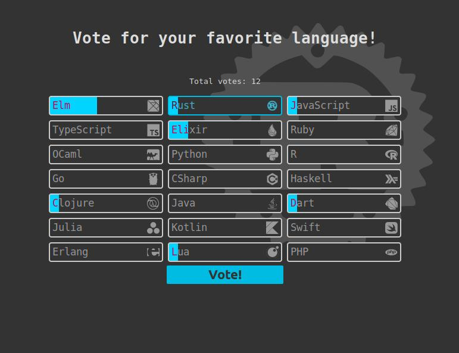

# Votingdapp [WIP]

A simple dapp to share voting data. 

## Technologies

### Languages

- Rust
- Elm
- TypeScript

### Libs/Frameworks

- Tauri
- Parcel
- libp2p

### Style

- Stylus
- [devicons](https://devicon.dev/)

## Inspired By

- [JonasKruckenberg's tauri-libp2p-chat](https://github.com/JonasKruckenberg/tauri-libp2p-chat)
- A nice tutorial https://blog.logrocket.com/libp2p-tutorial-build-a-peer-to-peer-app-in-rust/

## TODO

- sync data between peers
- find a way to authenticate users so they only vote once
    - add authentication wall to vote